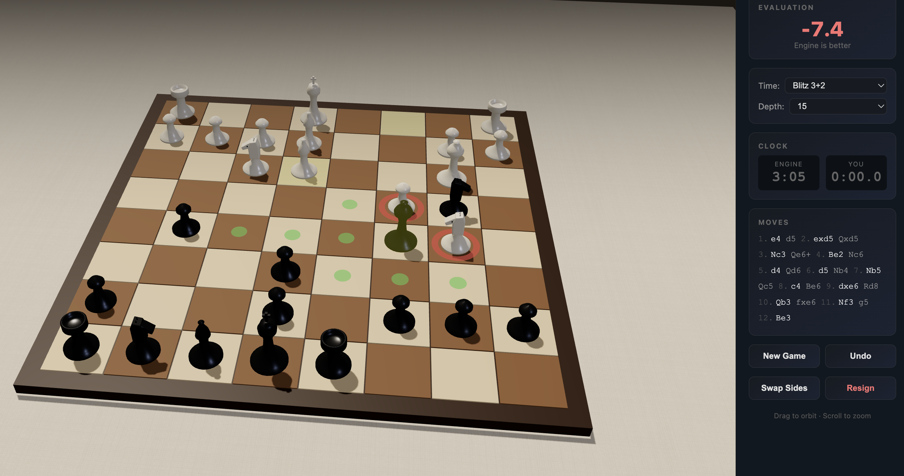

# 3D Chess vs Stockfish

A fully interactive 3D chess game running in a Docker container. Play against the Stockfish engine through a beautiful Three.js board with realistic lighting, shadows, and procedural sound effects.



## Quick Start

```bash
docker compose up --build -d
```

Open **http://localhost:8000** in your browser.

## Features

- **True 3D board** — Three.js scene with orbit controls (drag to rotate, scroll to zoom), shadow-casting directional lighting, and a procedural coarse-weave linen tablecloth texture with normal-mapped wrinkles
- **Standing 3D pieces** — Lathe-turned geometry for each piece type; the knight has a composite horse head with ears and eyes
- **Captured pieces** — Taken pieces are displayed on the tablecloth beside the board
- **Chess clocks** — Bullet (1+0, 2+1), Blitz (3+2, 5+3), Rapid (10+5, 15+10), or Unlimited
- **Configurable engine strength** — Depth 10 (fast) to 20 (strong)
- **Sound effects** — Procedurally synthesized via Web Audio API: move, capture, check, castle, game over
- **Play either side** — Swap Sides rotates the camera and lets Stockfish open as white
- **Live evaluation** — Eval bar updates after each move, always oriented from the player's perspective
- **Move indicators** — Green dots for valid moves, red rings for captures
- **Animated moves** — Pieces arc through the air with eased motion
- **Resign and Undo** — Full game controls in the sidebar

## API Endpoints

| Method | Path | Description |
|--------|------|-------------|
| `GET` | `/` | Serves the 3D chess UI |
| `GET` | `/health` | Health check |
| `POST` | `/analyze` | Analyze a FEN position (best move + eval + top 3 lines) |
| `POST` | `/move` | Get Stockfish's best response to a position |
| `POST` | `/uci` | Raw UCI command passthrough |

### Example

```bash
curl -X POST http://localhost:8000/analyze \
  -H 'Content-Type: application/json' \
  -d '{"fen": "rnbqkbnr/pppppppp/8/8/8/8/PPPPPPPP/RNBQKBNR w KQkq - 0 1", "depth": 15}'
```

## Configuration

Environment variables (set in `docker-compose.yml` or shell):

| Variable | Default | Description |
|----------|---------|-------------|
| `STOCKFISH_DEPTH` | `20` | Engine search depth |
| `STOCKFISH_THREADS` | `2` | CPU threads |
| `STOCKFISH_HASH` | `256` | Hash table size in MB |

## Tech Stack

| Layer | Technology |
|-------|-----------|
| Engine | Stockfish 17 (via apt) |
| Backend | Python 3.12, FastAPI, Uvicorn |
| Frontend | Three.js, Chess.js, Web Audio API |
| Container | Docker, Docker Compose |
